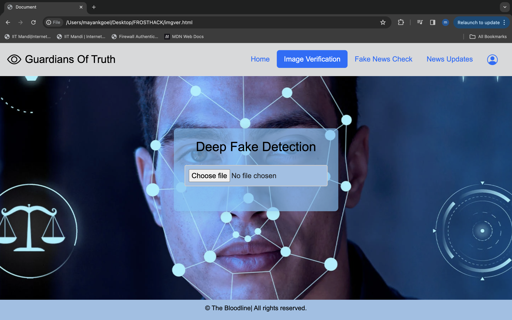

# Guardians of Truth

Welcome to the Bloodline project repository, developed by the team from IIT Mandi. Our project focuses on combating the spread of misinformation and deepfakes, providing innovative solutions to protect individuals and promote truth in the digital age.

### Table of Contents
1. [Introduction](#introduction)
2. [Tech Stack](#tech-stack)
3. [Dataset](#dataset)
4. [Functioning of model](#functioning-of-model)
5. [Features](#features)
6. [Quick Start](#quick-start)
7. [Demo](#demo)

## Introduction

In today's digital landscape, the proliferation of deepfake technology and fake news poses significant threats to society. Deepfakes, which are highly realistic manipulated media, have the potential to deceive individuals and manipulate public opinion. Similarly, the spread of fake news undermines trust in information sources and leads to widespread misinformation. Recognizing the urgent need to address these challenges, our team has developed the Bloodline project, which offers a suite of tools designed to safeguard individuals from the perils of manipulated media and false information.

## Tech Stack

# *Frontend:* 
  - HTML 
  - CSS
  - JavaScript
  - Bootstrap
# *Backend:*
  - Express.js
  - Node.js
  - PostgreSQL
  - FastAPI 
# *AI Models:*
  - Vision Transformers (Clip ViT-14)
  - Fully Connected Neural Network (FCNN)
  - LSTM
  - Gemini

## Dataset

### Deepfake Detection
- **Source:** Collected from various Generative AI (Gen-AI) models, including Generative Adversarial Networks (GAN), Diffusion models, and DALLE.
- **Description:** This dataset comprises a diverse collection of manipulated media generated by cutting-edge AI models. These deepfake videos and images serve as the foundation for training our AI models to accurately detect and classify manipulated content. By leveraging data sourced from state-of-the-art Generative AI models, our deepfake detection system is equipped to identify sophisticated manipulations and ensure the integrity of visual media.

### Fake News Detection
- **Source:** Sourced from Kaggle datasets containing a mixture of authentic and fabricated news articles.
- **Description:** The fake news detection dataset consists of a comprehensive collection of news articles spanning various topics and genres. This dataset enables our AI models to distinguish between genuine and fabricated news content, facilitating the identification and mitigation of misinformation. By training on a diverse range of news articles, our fake news detection system is equipped to combat the spread of false information and promote the dissemination of accurate and reliable news sources.

## **Functioning of model**

## Features

### 1. Guardian and TruthGuard AI Models

#### Guardian: Defending Against Deepfakes
Guardian is an advanced AI model specifically designed to analyze images and detect deepfakes. Leveraging state-of-the-art technology, Guardian employs sophisticated algorithms to scrutinize images and identify signs of manipulation. By detecting deepfakes, Guardian helps individuals safeguard their online presence and protect themselves from potential harm. Furthermore, Guardian also verifies the authenticity of images, ensuring that users can trust the content they encounter online.

#### TruthGuard: Combatting Fake News
TruthGuard is a powerful tool developed to detect fake news articles and combat the spread of misinformation. Utilizing cutting-edge machine learning techniques, TruthGuard analyzes news content to distinguish between genuine and fabricated information. By training on a diverse dataset comprising both real and fake news articles, TruthGuard has been fine-tuned to accurately classify news content and provide users with reliable information. Additionally, TruthGuard cross-references its results with a Gemini model to identify relevant news articles, ensuring that users receive timely and pertinent updates.

### 2. Sign-in Process with Secure Storage

To ensure the security of user data, the Bloodline project implements a robust sign-in process with secure storage mechanisms. Users can securely access the platform by providing their credentials through a POST request system. User data is stored in a PostgreSQL database, utilizing industry-standard encryption techniques to safeguard sensitive information. By employing bcrypt hashing for password storage, the Bloodline project prioritizes the protection of user privacy and security.

### 3. Image Verification

The Bloodline project incorporates advanced image verification capabilities to identify and combat deepfakes. Leveraging a comprehensive dataset sourced from state-of-the-art AI models such as GAN and DALL-E, the project's AI models have been trained to recognize patterns indicative of image manipulation. Using the Clip Vit-14 model for feature extraction, the project's AI accurately classifies images as either genuine or manipulated, providing users with the assurance of authenticity.

### 4. News Update Feature

In today's rapidly evolving world, access to accurate and reliable news is essential for making informed decisions and understanding global events. To facilitate this, the Bloodline project integrates a news-bot feature, providing users with the latest news updates from reputable sources. By aggregating news content from trusted sources, the news-bot ensures that users have access to timely and credible information, enabling them to stay informed and engaged with current affairs.

## Quick Start

## Demo

## Contributors

The project was developed by the following contributors-
- Toshan gupta
- Mayank goel (mlgoel3)
- Vishnu
- Naman Singhania 

